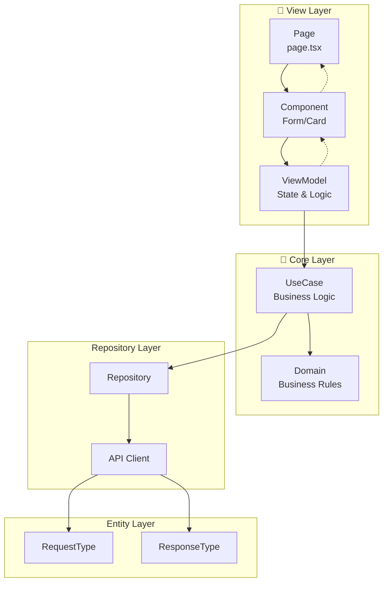

# 📅 일정공유 앱 - Schedule Share App

Next.js 15와 클린 아키텍처(MVVM 패턴)를 기반으로 구축된 일정 공유 애플리케이션입니다.

## 🚀 기술 스택

- **Frontend**: Next.js 15 (App Router), React 18, TypeScript
- **UI**: Tailwind CSS, shadcn/ui
- **Architecture**: Clean Architecture (MVVM Pattern)
- **State Management**: Zustand
- **Data Fetching**: React Query
- **Authentication**: JWT Token 기반
- **API Communication**: Axios/Fetch API
- **Testing**: Jest, React Testing Library
- **Deployment**: Vercel

## 📁 프로젝트 구조

```
src/
├── app/                          # Next.js 15 App Router (Pages)
│   ├── (auth)/                  # 인증 페이지
│   │   ├── login/page.tsx       # 🔴 LoginMain
│   │   └── register/page.tsx    # 🔴 RegisterMain
│   ├── (app)/                   # 메인 앱 페이지
│   │   ├── dashboard/page.tsx   # 🔴 DashboardMain
│   │   ├── schedules/           # 일정 관리
│   │   └── groups/              # 그룹 관리
│   └── api/                     # API Routes
│
├── core/                        # 🔵 Core Layer (Domain + UseCase)
│   ├── domain/                  # 도메인 모델
│   │   ├── AuthDomain.ts
│   │   ├── ScheduleDomain.ts
│   │   └── GroupDomain.ts
│   └── usecases/               # 유즈케이스 (비즈니스 로직)
│       ├── auth/
│       ├── schedule/
│       └── group/
│
├── presentation/               # 🔴 View Layer (Components + ViewModels)
│   ├── components/            # React 컴포넌트
│   │   ├── auth/LoginForm.tsx    # 🔴 LoginForm
│   │   ├── schedule/            # 일정 컴포넌트
│   │   └── group/               # 그룹 컴포넌트
│   └── viewmodels/            # 🔴 ViewModel Layer
│       ├── LoginViewModel.ts
│       ├── ScheduleViewModel.ts
│       └── GroupViewModel.ts
│
├── infrastructure/            # Repository & API Layer
│   ├── repositories/         # Repository 구현체
│   ├── api/                  # API 클라이언트
│   │   ├── AuthApi.ts           # 🔴 LoginApi
│   │   ├── ScheduleApi.ts
│   │   └── GroupApi.ts
│   └── types/                # API 타입 정의
│       ├── LoginRequestType.ts   # 🔴 LoginRequestType
│       ├── LoginResponseType.ts  # 🔴 LoginResponseType
│       └── ...
│
├── shared/                   # 공통 모듈
│   ├── hooks/               # Custom React Hooks
│   ├── utils/               # 유틸리티
│   ├── constants/           # 상수
│   └── types/               # 공통 타입
│
└── di/                      # Dependency Injection
    ├── container.ts
    └── bindings.ts
```

## 🏗️ 아키텍처 개요

### MVVM 패턴 기반 클린 아키텍처



### 의존성 방향 규칙

- **외부 → 내부**: 외부 계층만 내부 계층에 의존
- **View → Core**: UI는 비즈니스 로직에 의존
- **Infrastructure → Core**: 데이터 접근은 비즈니스 로직에 의존
- **Core는 독립적**: 가장 안정적이고 변경이 적은 계층

## 📋 주요 기능

### 🔐 인증 시스템
- 사용자 로그인/회원가입
- JWT 토큰 기반 인증
- 세션 관리

### 📅 일정 관리
- 일정 생성/수정/삭제
- 캘린더 뷰
- 일정 검색 및 필터링

### 👥 그룹 관리
- 그룹 생성 및 관리
- 그룹 멤버 초대
- 그룹 일정 공유

### 🔗 공유 기능
- 일정 공유 링크 생성
- 공개/비공개 설정
- 실시간 업데이트

## 🛠️ 개발 환경 설정

### 1. 프로젝트 클론
```bash
git clone https://github.com/your-username/schedule-share-app.git
cd schedule-share-app
```

### 2. 의존성 설치
```bash
npm install
# 또는
yarn install
```

### 3. 환경 변수 설정
```bash
cp .env.example .env.local
```

`.env.local` 파일을 편집하여 필요한 환경 변수를 설정하세요:

```env
# Backend API
NEXT_PUBLIC_API_URL="http://localhost:8000/api"

# External APIs (Optional)
NEXT_PUBLIC_GOOGLE_CLIENT_ID="your-google-client-id"
```

### 4. 백엔드 서버 실행
별도의 백엔드 서버를 실행해야 합니다:
```bash
# 백엔드 서버가 http://localhost:8000에서 실행되어야 합니다
# 백엔드 저장소의 README를 참고하세요
```

### 5. 개발 서버 실행
```bash
npm run dev
# 또는
yarn dev
```

개발 서버가 [http://localhost:3000](http://localhost:3000)에서 실행됩니다.

## 🧪 테스트

### 단위 테스트
```bash
npm run test
# 또는
yarn test
```

### 통합 테스트
```bash
npm run test:integration
# 또는
yarn test:integration
```

### E2E 테스트
```bash
npm run test:e2e
# 또는
yarn test:e2e
```

## 📚 코드 구조 가이드

### 1. 새로운 기능 추가하기

#### Domain 생성
```typescript
// core/domain/NewFeatureDomain.ts
export class NewFeatureDomain {
  constructor(private data: string) {}
  
  validate(): boolean {
    // 도메인 검증 로직
    return this.data.length > 0;
  }
}
```

#### UseCase 생성
```typescript
// core/usecases/NewFeatureUseCase.ts
export class NewFeatureUseCase {
  constructor(private repository: NewFeatureRepository) {}
  
  async execute(domain: NewFeatureDomain): Promise<Result> {
    if (!domain.validate()) {
      throw new Error('Invalid domain');
    }
    
    return await this.repository.save(domain);
  }
}
```

#### ViewModel 생성
```typescript
// presentation/viewmodels/NewFeatureViewModel.ts
export class NewFeatureViewModel {
  constructor(private useCase: NewFeatureUseCase) {}
  
  async handleAction(data: string) {
    const domain = new NewFeatureDomain(data);
    return await this.useCase.execute(domain);
  }
}
```

#### Component 생성
```typescript
// presentation/components/NewFeatureForm.tsx
export const NewFeatureForm = () => {
  const viewModel = new NewFeatureViewModel(useCase);
  
  const handleSubmit = async (data: string) => {
    const result = await viewModel.handleAction(data);
    // 결과 처리
  };
  
  return (
    <form onSubmit={handleSubmit}>
      {/* UI 컴포넌트 */}
    </form>
  );
};
```

### 2. API 타입 정의
```typescript
// infrastructure/types/newfeature.ts
export interface NewFeatureRequestType {
  data: string;
}

export interface NewFeatureResponseType {
  id: string;
  data: string;
  createdAt: string;
}
```

### 3. Repository 구현
```typescript
// infrastructure/repositories/NewFeatureRepository.ts
export class NewFeatureRepository {
  constructor(private apiClient: ApiClient) {}
  
  async save(domain: NewFeatureDomain): Promise<NewFeatureResponseType> {
    const request: NewFeatureRequestType = {
      data: domain.getData()
    };
    
    const response = await this.apiClient.post('/newfeature', request);
    return response.data;
  }
  
  async findById(id: string): Promise<NewFeatureResponseType> {
    const response = await this.apiClient.get(`/newfeature/${id}`);
    return response.data;
  }
}
```

### 4. API Client 설정
```typescript
// infrastructure/api/ApiClient.ts
export class ApiClient {
  private baseURL = process.env.NEXT_PUBLIC_API_URL;
  
  async get(endpoint: string) {
    const response = await fetch(`${this.baseURL}${endpoint}`, {
      headers: {
        'Authorization': `Bearer ${getToken()}`,
        'Content-Type': 'application/json'
      }
    });
    
    if (!response.ok) {
      throw new Error(`API Error: ${response.status}`);
    }
    
    return response.json();
  }
  
  async post(endpoint: string, data: any) {
    const response = await fetch(`${this.baseURL}${endpoint}`, {
      method: 'POST',
      headers: {
        'Authorization': `Bearer ${getToken()}`,
        'Content-Type': 'application/json'
      },
      body: JSON.stringify(data)
    });
    
    if (!response.ok) {
      throw new Error(`API Error: ${response.status}`);
    }
    
    return response.json();
  }
}
```

### 백엔드 연동 확인
프론트엔드 배포 전에 백엔드 API가 정상적으로 배포되어 있는지 확인하세요.


### 커밋 메시지 규칙
```
feat: 새로운 기능 추가
fix: 버그 수정
docs: 문서 업데이트
style: 코드 포맷팅
refactor: 코드 리팩토링
test: 테스트 추가/수정
chore: 빌드 프로세스 또는 보조 도구 변경
```